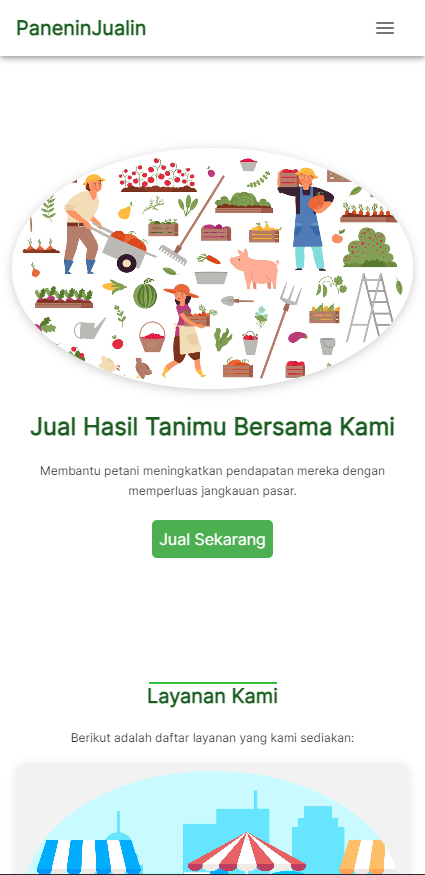

## PaneninJualin
> Ini adalah repository GitHub untuk PaneninJualin. Kami adalah sebuah organisasi yang mengembangkan aplikasi berbasis website untuk membantu petani mendistribusikan hasil taninya secara langsung tanpa adanya pihak distributor.

## Deskripsi Singkat
PaneninJualin adalah aplikasi berbasis website yang bertujuan untuk memberdayakan petani dengan cara membantu mereka mendistribusikan hasil taninya secara langsung ke konsumen tanpa melalui pihak distributor. Melalui platform ini, petani dapat memasarkan produk-produk mereka, berinteraksi langsung dengan pelanggan, dan meningkatkan pendapatan mereka.    
Kontributor: Tim <b>C23-M4039</b>  
Repositori: [Github](https://github.com/PaneninJualin-C23M4039)  
Website: [PaneninJualin](https://panenin-jualin.vercel.app)

## Tim
Anggota-anggota dari tim <b>C23-M4039</b> yang terlibat dalam proyek ini adalah:

* Satyo Gusti Anugrah - F040XB344 - [LinkedIn](https://www.linkedin.com/in/satyogustianugrah/)
* Mohammad Hoki Rezky - F019XB476 - [LinkedIn](https://www.linkedin.com/in/mhokirezky/)
* Syaloommuel Sirait - F043XB061 - [LinkedIn](https://www.linkedin.com/in/syaloommuel-sirait-3b263b221/)
* Azzam Ghufron Nasution - F016XB056 - [LinkedIn](https://www.linkedin.com/in/azzam-ghufron-nasution-6a1950250/)

